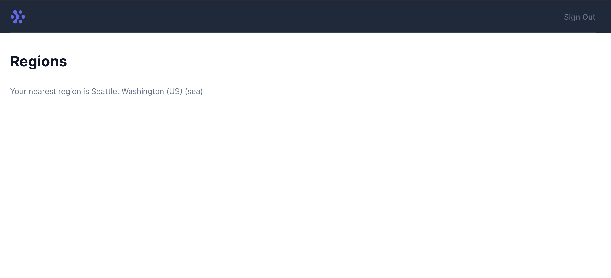

# Fly.io Full Stack Phoenix Hiring Project

Hello! This is a hiring project for our Full Stack developer fellowship position. If you apply, we'll ask you to do this project so we can assess your ability build customer facing features with the Fly.io GraphQL api in an Elixir/Phoenix/LiveView application.

## The Job

As a full stack developer at Fly.io, you'll be working with the parts of our product that customers interact directly with, such as our web dashboard, conversion funnels, landing pages, blog, and critical systems for authentication, billing, emails, and more. Most of our UX stack is built on Ruby and Rails, but after falling in love with Phoenix, we'll be doing a lot more Phoenix than Rails. You'll need to get comfortable working in Phoenix, but it's okay to learn on the fly.

## Hiring Project

This app is a simplified version of the fly.io web dashboard built with the [Phoenix Framework](https://phoenixframework.org). It uses our GraphQL api to fetch data from your account and render it with LiveView. You can see a running version here: https://full-stack-fellowship-project.fly.dev. Note, you'll need your Fly.io personal access token to access this page. See [Tips and Tricks](#tips-and-tricks) for more info.

This project is built on Elixir Phoenix. It's ok if you don't yet know Elixir or Phoenix! We think you can learn, and are happy to have you learn while you do this project if you'd like. You'll need to install [Elixir](https://elixir-lang.org/install.html) and [Phoenix](https://hexdocs.pm/phoenix/installation.html#phoenix) in order to run the app locally. Once that is setup, you're ready to get started.

Right now this app shows the closest Fly.io region to you. It should look like this, but with _your_ closest Fly.io region listed:





Your job is to add a list of all Fly.io regions to this page. `flyctl platform regions` is a command that does this on the CLI. It looks like this:

```
$ flyctl platform regions
CODE	NAME                        	GATEWAY 
ams 	Amsterdam, Netherlands      	✓      	
cdg 	Paris, France               	✓      	
dfw 	Dallas, Texas (US)          	✓      	
ewr 	Secaucus, NJ (US)           	       	
fra 	Frankfurt, Germany          	✓      	
gru 	São Paulo                   	       	
hkg 	Hong Kong                   	✓      	
iad 	Ashburn, Virginia (US)      	✓      	
lax 	Los Angeles, California (US)	✓      	
lhr 	London, United Kingdom      	✓      	
maa 	Chennai (Madras), India     	✓      	
mad 	Madrid, Spain               	       	
mia 	Miami, Florida (US)         	       	
nrt 	Tokyo, Japan                	✓      	
ord 	Chicago, Illinois (US)      	✓      	
scl 	Santiago, Chile             	✓      	
sea 	Seattle, Washington (US)    	✓      	
sin 	Singapore                   	✓      	
sjc 	Sunnyvale, California (US)  	✓      	
syd 	Sydney, Australia           	✓      	
yyz 	Toronto, Canada             	✓      
```

The design is up to you -- make the best UX you can in a reasonable amount of time. 

We've already made the GraphQL query you need to use for this: `Client.fetch_regions`, all you need to do is perform this query from the controller's action and add html to the template.

Once you're happy with your work, deploy it to a new fly app so you can see it in action. The repo already has a `Dockerfile`, so it should be as simple as `flyctl launch`. Note, you'll need to set the SECRET_KEY_BASE environment variable in order for cookies to work. Do this by running `flyctl secrets set SECRET_KEY_BASE=$(mix phx.gen.secret)`.

We expect this to take about 1-2 hours. We're not timing you, though. Take as much time as you need, just don't go overboard and spend hours on it.

### Submitting your work
Once your app is deployed, submit the following via email:
- a link to your live app
- a link to your source code
- add a `notes.md` file with a short summary of
  - what you built and what you didn't build
  - what you'd improve or fix if you had more time

After you've submitted your project, we'll have 3 Fly.io engineers evaluate your work with standardized criteria. This takes 3-5 days and we'll let you know as soon as we have results.

### What we care about

- Always strive to make the best developer UX possible (a great UX can be ugly, though! we're not grading you on graphic design skills)
- Don't spend time making this perfect. Rough edges are fine if it helps you move quickly, just note them in the summary.
- If something is too complicated, try to get by without it and explain what you wanted to do in the summary.
- The notes are important! We want to know how you think about end users and how you make decisions.

### What we don't care about

- Don't spend time writing tests for this sample. Tests are great, but time consuming.
- If you're like us, pride pushes you to make things better than they need to be. Don't do that for this project. Channel that energy into your notes, keep the scope of your code small.
- Edge cases. Don't solve every scenario in code. If you think of edge cases or gotchas that might affect users, put 'em in your notes.

## Getting Started 

To start your Phoenix server:

  * Install dependencies with `mix deps.get`
  * Install Node.js dependencies with `npm install` inside the `assets` directory
  * Compile assets with `npm run deploy`
  * Start Phoenix endpoint with `mix phx.server`

Now you can visit [`localhost:4000`](http://localhost:4000) from your browser.

Ready to run in production? Please [check our deployment guides](https://fly.io/docs/hands-on/start/).

### Tips and Tricks

- You'll need a fly.io personal access token in order to use the api. You can get your api token by running `flyctl auth token` or from the [web dashboard](https://web.fly.io/user/personal_access_tokens).
- You can test your queries in our [GraphQL playground](https://api.fly.io/graphql).
- Use `flyctl scale count`, `flyctl vm stop`, `flyctl vm restart`, and deploys to change your test app's VMs 
- The app is built with [Tailwind CSS](https://tailwindcss.com). It's okay to refer to the docs or use whatever markup you found on StackOverflow to get the look you want without spending too much time
